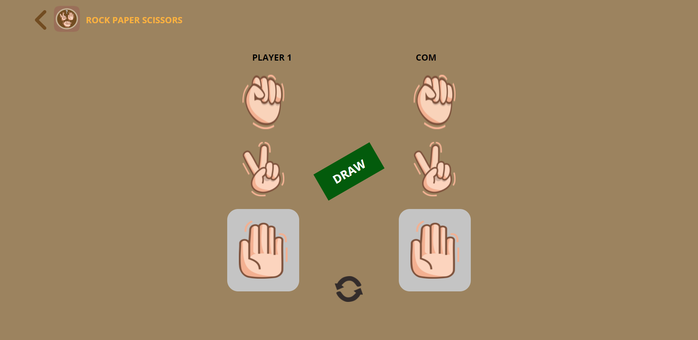

# Overview

Binar Academy challenge for chapter 4. The main challenge is to make a game "suit" / rock paper scissors with Vanilla Javascript and OOP Concept (Classes & Inheritance). UI for the game is sliced from figma file provided by Binar Academy.

### Features

- Rock Paper Scissors as Player
- Reset Button
- Back to Homepage/Landing Page

### Screenshot

## My Process

### Built with

- HTML5
- CSS3
- Object-Oriented Programming JavaScript

### What I Learned

Learned a lot about programming paradigm which is OOP, im used with with Functional Programming in JavaScript but learning another way to code in the same languange is pretty challenging

### Continued Development

Will be continued in NodeJs Chapter

## Author

- althafdaa
